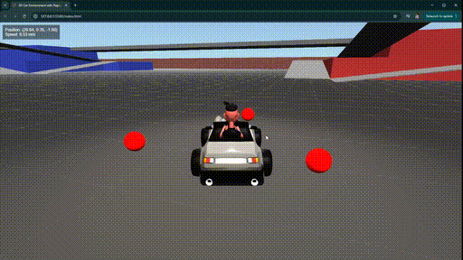

# kartgame_demo
- Simple kart game inspired by Mario Kart that uses Three.js and Rapier physics.
- Clone the repository and run the index.html with Live Server to test it out.
- Control the kart direction with WASD and use SPACE BAR to fire the projectiles.

**If you get value from this repository follow me on X [@renderfiction](https://x.com/renderfiction)**

